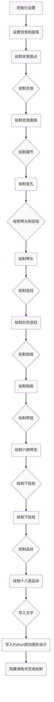

# 吉他空之声设计说明

### [*turtle*库介绍及函数的使用](https://mp.weixin.qq.com/s?__biz=MzUxNDE4MTQ5Mg==&mid=2247485161&idx=1&sn=11c316d1feacad90465783e7726289f1&chksm=f94896f2ce3f1fe457feea0b34dd67440c1c02c7a39b35dd6362c4435716c5107171260c3348&scene=27)

原始代码

```Python
import turtle as q
import time  # 导入time模块，使用time.sleep(1)指令使得每画完一个结构后都停顿1秒
import random  # 导入随机模块

q.bgpic(r"C:\Users\yxn\Downloads\渐变色背景.png")  # 设置背景图片
q.pensize(3)
q.speed(0)
q.delay(0)  # 将绘图延迟时间设置为0，绘图速度会更快

# 绘制背景上散落的圆点
for i in range(100):
    x = random.randint(-400, 400)
    y = random.randint(-300, 300)
    q.penup()
    q.goto(x, y)
    q.pendown()
    q.speed(900)
    q.color("#d2a4b4")
    a = random.randint(2, 7)
    q.dot(a)
q.penup()
q.home()  # 让海龟回到初始位置，即原点(0,0),并且朝右
q.pendown()

q.delay(1)  # 将绘图延迟时间设置为1，相当于关闭delay(0)的加速效果
# ① 绘制吉他面板
q.pencolor('black')
q.fillcolor("#E6AE00")
q.begin_fill()
q.left(90)
q.penup()
q.forward(50)
q.pendown()
q.right(90)
q.circle(-40, 120)
q.left(20)
q.circle(70, 10)
q.left(60)
q.circle(-50, 140)
q.right(10)
q.forward(35)
q.right(10)
q.circle(-50, 140)
q.left(60)
q.circle(70, 10)
q.left(20)
q.circle(-40, 120)
q.goto(0, 50)
q.penup()
q.end_fill()

time.sleep(1)  # 停顿1秒后再执行（此代码可直接删除）
# ② 绘制音孔
q.goto(0, -20)
q.pencolor('darkgreen')
q.dot(50)
q.pencolor('red')
q.dot(45)
q.pencolor('black')
q.dot(35)

time.sleep(1)  # 停顿1秒后再执行（此代码可直接删除）
# ③ 绘制琴头和弦钮
q.pensize(1)
q.left(90)
q.goto(0, 0)
q.forward(120)
q.pendown()
q.right(90)
q.begin_fill()
for j in range(2):
    if j == 0:
        q.forward(10)
        q.left(90)
    for i in range(3):
        q.forward(5)
        q.right(90)
        q.forward(3)
        q.right(90)
        q.forward(3)
        q.left(90)
        q.forward(3)
        q.left(90)
        q.forward(9)
        q.left(90)
        q.forward(3)
        q.left(90)
        q.forward(6)
        q.forward(-3)
        q.right(90)
        q.forward(3)
        q.right(90)
        q.forward(-3)
        q.forward(8)
    if j == 0:
        q.left(30)
        q.forward(20)
        q.left(120)
        q.forward(20)
        q.left(30)
    else:
        q.left(90)
        q.forward(10)
q.end_fill()

time.sleep(1)  # 停顿1秒后再执行（此代码可直接删除）
# ④ 绘制两组白色弦柱
q.fillcolor('white')
q.penup()
q.forward(2)
q.left(90)
q.forward(4)
q.pendown()
q.begin_fill()
for i in range(2):
    q.forward(30)
    q.right(90)
    q.forward(4)
    q.right(90)
q.end_fill()

q.penup()
q.left(90)
q.forward(8)
q.right(90)
q.pendown()
q.begin_fill()
for i in range(2):
    q.forward(30)
    q.right(90)
    q.forward(4)
    q.right(90)
q.end_fill()

time.sleep(1)  # 停顿1秒后再执行（此代码可直接删除）
# ⑤ 绘制吉他的指板
q.fillcolor('black')
q.pensize(0)
q.begin_fill()
q.penup()
q.forward(-4)
q.pendown()
q.forward(-126)
q.circle(-6, 180)
q.forward(-126)
q.end_fill()

time.sleep(1)  # 停顿1秒后再执行（此代码可直接删除）
# ⑥ 绘制6根弦
c = 'yellow'
co = 'darkyellow'
colors = [c, c, c, co, co, co]
q.pensize(0.5)
for i in range(6):
    color = colors[(1 % 8)]
    q.pencolor(color)
    q.penup()
    q.right(90)
    q.forward(1.75)
    q.left(90)
    q.pendown()
    q.forward(190)
    q.forward(-190)

time.sleep(1)  # 停顿1秒后再执行（此代码可直接删除）
# ⑦ 绘制下弦枕
q.penup()
q.forward(190)
q.left(90)
q.forward(-20)
q.pencolor('black')
q.pensize(10)
q.pendown()
q.forward(48)

q.pencolor('white')
q.penup()
q.pensize(1)
q.forward(-12)
q.right(90)
q.forward(5)
q.left(90)
for i in range(3):
    q.pendown()
    q.forward(-24)
    q.forward(24)
    q.penup()
    q.left(90)
    q.forward(5)
    q.right(90)

time.sleep(1)  # 停顿1秒后再执行（此代码可直接删除）
# ⑧ 绘制18道品丝
# 吉他品丝就是音品。品丝是指按精准间距嵌在整个指板上的薄金属条。
q.pensize(1)
q.penup()
q.goto(0, 0)
q.forward(-3)
for i in range(18):
    q.pendown()
    q.forward(6)
    q.forward(-6)
    q.penup()
    q.left(90)
    q.forward(7)
    q.right(90)

# ⑨ 写文字
q.pencolor("white")  # 文字是白色
q.goto(0, -200)
q.write("Python原创图形设计：吉他与梦幻天空", align="center", font=("隶书", 18))  # 居中书写文字

q.hideturtle()

q.done()
```

**turtle绘画思路：**

- 第1步：绘制吉他面板
- 第2步：绘制音孔
- 第3步：绘制琴头和弦钮
- 第4步：绘制两组白色弦柱
- 第5步：绘制吉他的指板
- 第6步：绘制6根琴弦
- 第7步：绘制下弦枕
- 第8步：绘制18道品丝

```Python
import turtle as q
import time  # 导入time模块，使用time.sleep(1)指令使得每画完一个结构后都停顿1秒
import random  # 导入随机模块

q.bgpic("./渐变色背景.png")  # 设置背景图片
q.pensize(3)  # 设置画笔粗细为3
q.speed(0)  # 设置绘图速度为0，即最快
q.delay(0)  # 将绘图延迟时间设置为0，绘图速度会更快

# 绘制背景上散落的圆点
for i in range(100):  # 循环100次
    x = random.randint(-400, 400)  # 随机生成x坐标
    y = random.randint(-300, 300)  # 随机生成y坐标
    q.penup()  # 抬起画笔
    q.goto(x, y)  # 将画笔移动到(x,y)坐标
    q.pendown()  # 放下画笔
    q.speed(900)  # 设置绘图速度为900
    q.color("#d2a4b4")  # 设置画笔颜色为粉色
    a = random.randint(2, 7)  # 随机生成圆点的半径
    q.dot(a)  # 绘制圆点
q.penup()  # 抬起画笔
q.home()  # 让海龟回到初始位置，即原点(0,0),并且朝右
q.pendown()  # 放下画笔

q.delay(1)  # 将绘图延迟时间设置为1，相当于关闭delay(0)的加速效果
# ① 绘制吉他面板
q.pencolor('black')  # 设置画笔颜色为黑色
q.fillcolor("#E6AE00")  # 设置填充颜色为黄色
q.begin_fill()  # 开始填充
q.left(90)  # 海龟左转90度
q.penup()  # 抬起画笔
q.forward(50)  # 向前移动50个单位
q.pendown()  # 放下画笔
q.right(90)  # 海龟右转90度
q.circle(-40, 120)  # 绘制半径为40，角度为120的弧
q.left(20)  # 海龟左转20度
q.circle(70, 10)  # 绘制半径为70，角度为10的弧
q.left(60)  # 海龟左转60度
q.circle(-50, 140)  # 绘制半径为50，角度为140的弧
q.right(10)  # 海龟右转10度
q.forward(35)  # 向前移动35个单位
q.right(10)  # 海龟右转10度
q.circle(-50, 140)  # 绘制半径为50，角度为140的弧
q.left(60)  # 海龟左转60度
q.circle(70, 10)  # 绘制半径为70，角度为10的弧
q.left(20)  # 海龟左转20度
q.circle(-40, 120)  # 绘制半径为40，角度为120的弧
q.goto(0, 50)  # 将画笔移动到(0,50)坐标
q.penup()  # 抬起画笔
q.end_fill()  # 结束填充

time.sleep(1)  # 停顿1秒后再执行（此代码可直接删除）
# ② 绘制音孔
q.goto(0, -20)
q.pencolor('darkgreen')
q.dot(50)
q.pencolor('red')
q.dot(45)
q.pencolor('black')
q.dot(35)

time.sleep(1)  # 停顿1秒后再执行（此代码可直接删除）
# ③ 绘制琴头和弦钮
q.pensize(1)
q.left(90)
q.goto(0, 0)
q.forward(120)
q.pendown()
q.right(90)
q.begin_fill()
for j in range(2):  # 循环2次
    if j == 0:  # 如果j等于0
        q.forward(10)
        q.left(90)
    for i in range(3):  # 循环3次
        q.forward(5)
        q.right(90)
        q.forward(3)
        q.right(90)
        q.forward(3)
        q.left(90)
        q.forward(3)
        q.left(90)
        q.forward(9)
        q.left(90)
        q.forward(3)
        q.left(90)
        q.forward(6)
        q.forward(-3)
        q.right(90)
        q.forward(3)
        q.right(90)
        q.forward(-3)
        q.forward(8)
    if j == 0:  # 如果j等于0
        q.left(30)
        q.forward(20)
        q.left(120)
        q.forward(20)
        q.left(30)
    else:  # 否则
        q.left(90)
        q.forward(10)
q.end_fill()

time.sleep(1)  # 停顿1秒后再执行（此代码可直接删除）
# ④ 绘制两组白色弦柱
q.fillcolor('white')
q.penup()
q.forward(2)
q.left(90)
q.forward(4)
q.pendown()
q.begin_fill()  # 开始填充
for i in range(2):
    q.forward(30)
    q.right(90)
    q.forward(4)
    q.right(90)
q.end_fill()  # 结束填充

q.penup()
q.left(90)
q.forward(8)
q.right(90)
q.pendown()
q.begin_fill()  # 开始填充
for i in range(2):  # 循环2次
    q.forward(30)
    q.right(90)
    q.forward(4)
    q.right(90)
q.end_fill()  # 结束填充

time.sleep(1)  # 停顿1秒后再执行（此代码可直接删除）
# ⑤ 绘制吉他的指板
q.fillcolor('black')
q.pensize(0)
q.begin_fill()  # 开始填充
q.penup()
q.forward(-4)  # 向前移动4个单位
q.pendown()
q.forward(-126)
q.circle(-6, 180)  # 绘制半径为6，角度为180的半圆
q.forward(-126)
q.end_fill()  # 结束填充

time.sleep(1)  # 停顿1秒后再执行（此代码可直接删除）
# ⑥ 绘制6根弦
c = 'yellow'  # 定义颜色变量
co = 'darkyellow'  # 定义颜色变量
colors = [c, c, c, co, co, co]  # 定义颜色列表
q.pensize(0.5)  # 设置画笔粗细为0.5
for i in range(6):  # 循环6次
    color = colors[(1 % 8)]  # 从colors列表中取出颜色
    q.pencolor(color)
    q.penup()
    q.right(90)
    q.forward(1.75)
    q.left(90)
    q.pendown()
    q.forward(190)
    q.forward(-190)

time.sleep(1)  # 停顿1秒后再执行（此代码可直接删除）
# ⑦ 绘制下弦枕
q.penup()
q.forward(190)
q.left(90)
q.forward(-20)
q.pencolor('black')  # 设置画笔颜色为黑色
q.pensize(10)
q.pendown()
q.forward(48)

q.pencolor('white')  # 设置画笔颜色为白色
q.penup()
q.pensize(1)
q.forward(-12)
q.right(90)
q.forward(5)
q.left(90)
for i in range(3):  # 循环3次
    q.pendown()
    q.forward(-24)
    q.forward(24)
    q.penup()
    q.left(90)
    q.forward(5)
    q.right(90)

time.sleep(1)  # 停顿1秒后再执行（此代码可直接删除）
# ⑧ 绘制18道品丝
# 吉他品丝就是音品。品丝是指按精准间距嵌在整个指板上的薄金属条。
q.pensize(1)  # 设置画笔粗细为1
q.penup()  # 抬起画笔
q.goto(0, 0)  # 将画笔移动到(0,0)坐标
q.forward(-3)  # 向前移动3个单位
for i in range(18):  # 循环18次
    q.pendown()  # 放下画笔
    q.forward(6)  # 向前移动6个单位
    q.forward(-6)  # 向后移动6个单位
    q.penup()  # 抬起画笔
    q.left(90)  # 海龟左转90度
    q.forward(7)  # 向前移动7个单位
    q.right(90)  # 海龟右转90度

# ⑨ 写文字
q.pencolor("white")  # 文字是白色
q.goto(0, -200)  # 将画笔移动到(-200,0)坐标
q.write("Python原创图形设计：吉他与梦幻天空", align="center", font=("隶书", 18))  # 居中书写文字

q.hideturtle()  # 隐藏海龟画笔

q.done()  # 完成绘图

```


### 解释1

这段Python代码使用了`turtle`图形库来绘制一幅具有吉他形象的艺术作品。下面是对代码的逐行解释和注释，以帮助理解其工作原理和设计思路。

```Python
1import turtle as q
2import time  # 导入time模块，用于在绘制每个组件后暂停1秒
3import random  # 导入random模块，用于绘制背景上的随机圆点
4
5# 设置背景图片
6q.bgpic(r"C:\Users\yxn\Downloads\渐变色背景.png")
7
8# 设置画笔的宽度和速度
9q.pensize(3)
10q.speed(0)  # 最高速度，0表示无延迟
11q.delay(0)  # 禁用延迟，使绘图更流畅
12
13# 绘制背景上散落的圆点
14for i in range(100):  # 绘制100个随机圆点
15    x = random.randint(-400, 400)  # 随机X坐标
16    y = random.randint(-300, 300)  # 随机Y坐标
17    q.penup()  # 抬起画笔，移动时不绘制
18    q.goto(x, y)  # 移动到随机位置
19    q.pendown()  # 放下画笔，准备绘制
20    q.speed(900)  # 高速绘制圆点
21    q.color("#d2a4b4")  # 设置颜色
22    a = random.randint(2, 7)  # 随机圆点大小
23    q.dot(a)  # 绘制圆点
24
25q.penup()  # 抬起画笔，回到初始位置
26q.home()
27q.pendown()
28
29# 恢复正常的绘图延迟，以便观察绘制过程
30q.delay(1)
31
32# 绘制吉他面板
33q.pencolor('black')  # 设置画笔颜色
34q.fillcolor("#E6AE00")  # 设置填充颜色
35q.begin_fill()  # 开始填充
36q.left(90)  # 调整画笔方向
37q.penup()  # 抬起画笔，移动到合适位置
38q.forward(50)  # 移动
39q.pendown()  # 放下画笔
40q.right(90)  # 调整方向
41q.circle(-40, 120)  # 绘制曲线
42# ... (此处省略了一些绘制曲线的代码，遵循类似逻辑)
43q.goto(0, 50)  # 移动到指定位置
44q.penup()  # 结束填充
45q.end_fill()
46
47# 暂停1秒，以便观察
48time.sleep(1)
49
50# 绘制音孔
51q.goto(0, -20)  # 移动到音孔位置
52q.pencolor('darkgreen')  # 设置颜色
53q.dot(50)  # 绘制外圈
54q.pencolor('red')  # 更改颜色
55q.dot(45)  # 绘制中间层
56q.pencolor('black')  # 更改颜色
57q.dot(35)  # 绘制内圈
58
59# 暂停1秒，以便观察
60time.sleep(1)
61
62# 绘制琴头和弦钮
63q.pensize(1)  # 设置画笔宽度
64# ... (此处省略了一些绘制细节，遵循类似逻辑)
65# 绘制琴头的复杂形状
66q.begin_fill()  # 开始填充
67# ... (绘制多个直线和曲线)
68q.end_fill()  # 结束填充
69
70# 暂停1秒，以便观察
71time.sleep(1)
72
73# 绘制两组白色弦柱
74q.fillcolor('white')  # 设置填充颜色
75# ... (此处省略了一些绘制细节，遵循类似逻辑)
76# 绘制两组弦柱
77
78# 暂停1秒，以便观察
79time.sleep(1)
80
81# 绘制吉他的指板
82q.fillcolor('black')  # 设置填充颜色
83# ... (此处省略了一些绘制细节，遵循类似逻辑)
84# 绘制指板
85
86# 暂停1秒，以便观察
87time.sleep(1)
88
89# 绘制6根弦
90# ... (此处省略了一些绘制细节，遵循类似逻辑)
91# 使用循环绘制6根弦
92
93# 暂停1秒，以便观察
94time.sleep(1)
95
96# 绘制下弦枕
97# ... (此处省略了一些绘制细节，遵循类似逻辑)
98# 绘制下弦枕和白色间隔
99
100# 暂停1秒，以便观察
101time.sleep(1)
102
103# 绘制18道品丝
104# ... (此处省略了一些绘制细节，遵循类似逻辑)
105# 使用循环绘制18道品丝
106
107# 写文字
108q.pencolor("white")  # 设置文字颜色
109q.goto(0, -200)  # 移动到文字位置
110q.write("视觉传达设计-殷维：吉他与梦幻天空", align="center", font=("隶书", 18))  # 写入文字
111
112# 隐藏海龟
113q.hideturtle()
114
115# 结束绘图
116q.done()
```

整体设计实现：

1. **背景设置**：使用`bgpic`函数加载背景图片。
2. **散点绘制**：通过循环和随机数生成背景上的散点，增加视觉效果。
3. **吉他主体绘制**：通过一系列的曲线和直线绘制出吉他的形状，并使用`begin_fill`和`end_fill`函数填充颜色。
4. **音孔、弦钮、弦柱等细节**：通过精确的坐标移动和画笔操作绘制。
5. **弦线和品丝**：使用循环简化重复的绘制过程。
6. **文字标注**：在画面底部写入文字信息，标识作者和作品标题。

通过上述步骤，整个吉他图形和背景效果得以逐步构建，最终形成一幅完整的视觉传达设计作品。


### 解释2:

这段代码使用了Python的turtle图形库来绘制一个吉他的图像。turtle图形库是一个简单的绘图库，可以用来绘制各种形状和图案。下面是对这段代码的详细注释：

1. 首先，导入了turtle、time和random三个模块。turtle模块用于绘图，time模块用于暂停，random模块用于生成随机数。
2. 设置背景图片。使用`q.bgpic()`函数设置背景图片，参数是图片的路径。
3. 设置画笔的大小（`q.pensize(3)`）、速度（`q.speed(0)`）和延迟（`q.delay(0)`）。这些设置会影响绘制的图像的外观和绘制速度。
4. 绘制背景上的散落圆点。使用一个for循环，循环100次，每次循环生成一个随机位置（x, y）和随机大小（a），然后在该位置绘制一个圆点。
5. 绘制吉他的面板。首先设置画笔的颜色（`q.pencolor('black')`）和填充颜色（`q.fillcolor("#E6AE00")`），然后使用`q.begin_fill()`和`q.end_fill()`之间的命令来绘制面板的形状。
6. 绘制音孔。使用`q.goto()`函数将画笔移动到音孔的位置，然后使用`q.dot()`函数绘制三个不同大小的圆点，代表音孔。
7. 绘制琴头和弦钮。首先设置画笔的大小（`q.pensize(1)`），然后使用一系列的绘图命令来绘制琴头和弦钮的形状。
8. 绘制两组白色弦柱。首先设置填充颜色（`q.fillcolor('white')`），然后使用`q.begin_fill()`和`q.end_fill()`之间的命令来绘制两组弦柱的形状。
9. 绘制吉他的指板。首先设置填充颜色（`q.fillcolor('black')`），然后使用一系列的绘图命令来绘制指板的形状。
10. 绘制6根弦。首先设置画笔的大小（`q.pensize(0.5)`），然后使用一个for循环，循环6次，每次循环绘制一根弦。
11. 绘制下弦枕。首先将画笔移动到下弦枕的位置，然后设置画笔的颜色和大小，绘制下弦枕的形状。
12. 绘制18道品丝。首先设置画笔的大小（`q.pensize(1)`），然后使用一个for循环，循环18次，每次循环绘制一道品丝。
13. 写文字。首先设置画笔的颜色（`q.pencolor("white")`），然后将画笔移动到文字的位置，使用`q.write()`函数书写文字。
14. 隐藏画笔（`q.hideturtle()`），完成绘制（`q.done()`）。

整个设计是通过使用turtle库的各种绘图命令来实现的，包括绘制形状、填充颜色、移动画笔等。通过这些命令的有机组合，最终绘制出了一个吉他的图像。


### 解释3:



这个流程图概括了代码的主要步骤：

1. **导入库**：导入`turtle`、`time`和`random`库。
2. **初始化设置**：设置背景、画笔粗细和速度。
3. **绘制背景圆点**：在背景上绘制散落的圆点。
4. 绘制吉他：
	- **吉他面板**：绘制吉他的面板部分。
	- **音孔**：在面板上绘制音孔。
	- **琴头和弦钮**：绘制琴头和弦钮。
	- **两组白色弦柱**：在琴头上方绘制两组白色弦柱。
	- **指板**：绘制吉他的指板。
	- **6根琴弦**：在吉他上绘制6根琴弦。
	- **下弦枕**：在指板下方绘制下弦枕。
	- **18道品丝**：在指板上绘制18道品丝。
	- **写文字**：在画面底部写入文字说明。
5. **隐藏画笔&完成绘图**：隐藏`turtle`画笔，并结束绘图。